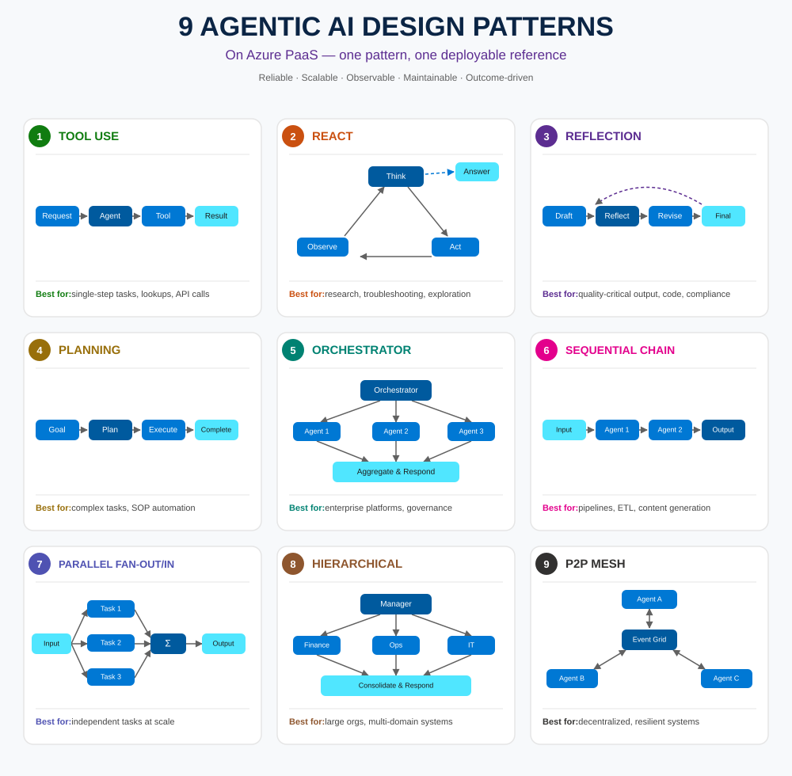

# 9 Agentic AI Design Patterns, Implemented on Azure PaaS

Most "agentic AI" content stops at the diagram: a box for the user, a box for the agent, an
arrow or two, done. This series and its companion repo go one level deeper — for each of the
nine common agentic design patterns, a working reference implementation built entirely on
managed Azure services, with the infrastructure as Bicep and the code deployable via
`azd up`.

The nine patterns split naturally into three groups: patterns that shape how a *single* agent
reasons (Tool Use, ReAct, Reflection, Planning), patterns that coordinate *multiple* agents
through a central point (Orchestrator, Sequential Chain, Parallel Fan-out/Fan-in, Hierarchical),
and one pattern that coordinates multiple agents with *no* central point at all (P2P Mesh).

## The patterns at a glance

<figure>
  
  <figcaption>All 9 patterns at a glance, each linked below to its own write-up and deployable Azure sample.</figcaption>
</figure>

| # | Pattern | Shape | Best for | Primary Azure services |
|---|---|---|---|---|
| 1 | [Tool Use](./01-tool-use.md) | One request → one tool → one answer | Single-step lookups, API calls, simple automation | Azure OpenAI, Azure Functions |
| 2 | [ReAct](./02-react.md) | Think → Act → Observe → repeat | Research, troubleshooting, dynamic exploration | Azure OpenAI, Durable Functions, Azure AI Search |
| 3 | [Reflection](./03-reflection.md) | Draft → self-review → revise | Quality-critical output: code, compliance text | Azure OpenAI (dual deployment), Durable Functions, Blob Storage |
| 4 | [Planning](./04-planning.md) | Decompose goal → execute steps → track progress | Multi-step workflows, SOP automation | Azure OpenAI, Durable Functions, Table Storage, Logic Apps |
| 5 | [Orchestrator](./05-orchestrator.md) | Coordinator delegates to specialist tools | Enterprise platforms, domain specialization | Azure AI Foundry Agent Service, Azure AI Search, Azure SQL |
| 6 | [Sequential Chain](./06-sequential-chain.md) | Fixed pipeline, stage → stage → stage | ETL, content pipelines, structured processing | Durable Functions, Azure OpenAI, Service Bus |
| 7 | [Parallel Fan-out/Fan-in](./07-parallel-fanout-fanin.md) | Branches run concurrently, then join | Independent sub-tasks at scale, batch summarization | Durable Functions (`Task.WhenAll`), Azure OpenAI |
| 8 | [Hierarchical](./08-hierarchical.md) | Manager supervises semi-autonomous domain experts | Large orgs, multi-domain systems, governance | Azure OpenAI, Service Bus (topic + sessions), Cosmos DB, SQL, AI Search |
| 9 | [P2P Mesh](./09-p2p-mesh.md) | Agents react to each other's events, no coordinator | Decentralized, resilient multi-agent ecosystems | Event Grid, Azure Functions, Cosmos DB |

## How the group boundaries actually play out on Azure

Patterns 1-4 live comfortably inside a single Azure Functions app. The differences between them
are almost entirely about *state*: Tool Use needs none, ReAct and Planning need a durable
scratchpad across steps (Durable Functions orchestrator), and Reflection needs an audit trail of
its own self-review (Blob Storage). None of these need a second compute resource.

Patterns 5-8 all introduce a second tier — one or more specialist agents behind the primary one
— but they differ in exactly how that tier is reached. Orchestrator's specialists are close to
stateless tools, reached in-process or over HTTP. Sequential Chain doesn't have specialist agents
at all in the same sense — it's a fixed sequence of stages, which is why a Durable Functions
orchestrator calling activities in a straight line (no fan-out, no branching) is enough; a
declarative low-code workflow engine like Logic Apps Standard is a reasonable alternative for the
same fixed shape, though it turned out less reliable to stand up for this particular sample.
Parallel Fan-out/Fan-in is the one pattern whose name matches an actual Azure Durable Functions
primitive (`Task.WhenAll`) almost exactly. Hierarchical is the odd one out in this group: its
sub-agents are message-driven over Service Bus rather than directly invoked, because they're
meant to scale and fail independently of the manager and of each other.

Pattern 9, P2P Mesh, is architecturally distinct from all the others: there is no resource in
the diagram you could point to and call "the coordinator." Event Grid's pub-sub model is what
makes that possible on Azure — every agent function publishes and subscribes to event types,
never to each other by name.

## Repo layout

```
agentic-ai-patterns-azure/
  docs/                          This overview + one post per pattern
  infra/modules/                 Shared Bicep: observability.bicep, openai.bicep
  patterns/
    01-tool-use/                 Each pattern is a self-contained, independently deployable unit
    02-react/                      - its own azure.yaml, infra/main.bicep, src/
    ...
    09-p2p-mesh/
```

Every pattern folder is independently deployable — `cd patterns/03-reflection && azd up`
provisions only that pattern's resources. Two pieces of infrastructure that would otherwise be
duplicated are factored into `infra/modules/` and referenced from each pattern's `main.bicep`:
Log Analytics + Application Insights (all nine patterns) and the Azure OpenAI account + model
deployments (eight of nine — Orchestrator provisions its own unified AI Foundry account instead,
since the Persistent Agents API it uses needs that specific resource type). Everything
pattern-specific (Azure AI Search, Service Bus, Cosmos DB, Event Grid, and so on) stays local to
that pattern's own Bicep file.

## Where to start

If you're evaluating which pattern fits a problem you actually have, start from the "Best for"
column above rather than the diagram shape — several patterns look superficially similar
(Orchestrator and Hierarchical, ReAct and Planning) but differ in exactly the dimension that
determines which one is cheaper to build and operate. Each linked post covers that trade-off
for its pattern specifically, and the matching `patterns/*` folder has a working sample to run
end to end.
