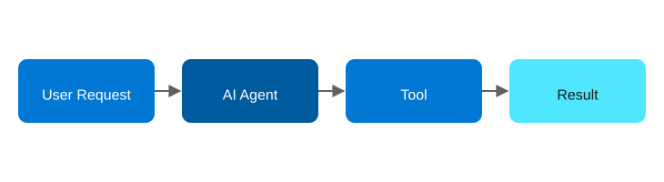

# Agentic AI Design Patterns on Azure, Part 1: Tool Use

<!-- Meta description: Learn the Tool Use agentic AI pattern and see how to deploy it on Azure with Azure OpenAI, Azure Functions, and a ready-to-run Bicep sample. -->

Tool Use is the simplest agentic pattern, and it's the one nearly every production system starts with. First, a user request goes to an AI agent. Next, the agent decides which tool to call. Then the tool runs, and the result comes back as an answer. There are no loops, no planning, and no multi-agent coordination — just a single, well-scoped decision about which capability to invoke.

It's the right starting point on Azure because every piece of it maps cleanly onto a managed service. As a result, you can have it running in production in an afternoon.

## The Tool Use pattern

`User Request → AI Agent → Tool (API/DB) → Result`

<figure>
  
  <figcaption>The Tool Use pattern: one agent picks a tool, the tool runs, and the result comes back as the answer.</figcaption>
</figure>

The agent's only job is to pick the right tool and shape its arguments correctly. Because of this narrow scope, the pattern works best for single-step tasks: data retrieval, an API call, or a simple automation like "look up this order status" or "convert this amount to euros."

## Azure architecture

| Component | Azure Service | Role |
|---|---|---|
| Reasoning | Azure OpenAI Service (GPT-4o) | Decides which tool to call and with what arguments, using native function calling |
| Tool execution | Azure Functions (HTTP trigger) | Hosts the actual tool implementations (lookups, calculations, external API calls) |
| Secrets | Azure Key Vault | Stores the Azure OpenAI key and any downstream API credentials |
| Observability | Application Insights | Traces every tool call and model round-trip |
| Entry point | Azure Functions (HTTP trigger) or Azure API Management | Receives the user request and starts the loop |

The whole system is two Azure Functions and one Azure OpenAI resource. There's no orchestration layer needed because the agent only ever takes one action per request.

## Implementation walkthrough

The agent function calls Azure OpenAI with a `tools` array describing the available functions (using the standard OpenAI function-calling schema, which Azure OpenAI implements directly). When the model responds with a `tool_calls` payload instead of plain text, the code resolves that to a concrete Azure Function — in the sample repo, a `GetOrderStatus` tool backed by a small in-memory/Table Storage lookup — invokes it, and feeds the result back to the model for a final natural-language answer.

The important design decision is keeping tool execution *out* of the model's context: the LLM never touches the database or API directly, it only ever asks for a tool to be run and receives back a JSON result. That boundary is what keeps this pattern safe to put in front of real systems.

## Deploying it

The companion repo ships as an `azd` (Azure Developer CLI) project. `azd up` provisions the Azure OpenAI resource with a GPT-4o deployment, the Function App, storage account, Key Vault, and Application Insights via Bicep, then deploys the C# Isolated Worker function code.

```bash
azd auth login
azd up
```

## When to reach for this pattern

Use Tool Use whenever the task is genuinely single-step: the agent doesn't need to remember what it did, doesn't need to check its own work, and doesn't need more than one round trip to a tool. It's also the right foundation to build on, since the other eight patterns reduce to repeated or composed Tool Use calls under the hood. In other words, once you understand this pattern, ReAct, Reflection, and Orchestrator all start to look like variations on the same idea.

**Repo:** `repos/01-tool-use` — Bicep IaC + C# Azure Functions (Isolated Worker) sample.
