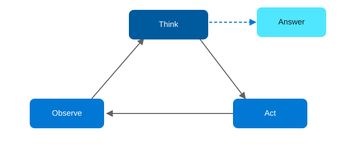

# Agentic AI Design Patterns on Azure, Part 2: ReAct

<!-- Meta description: Discover how the ReAct agentic AI pattern combines reasoning and action on Azure, using Durable Functions and Azure AI Search for grounding. -->

ReAct (Reason + Act) is what happens when Tool Use grows a loop. Instead of one decision and one tool call, the agent thinks, acts, observes the result, and repeats until it decides the goal is achieved. It's the pattern behind most "research assistant" and troubleshooting agents, because those tasks can't be solved in one shot. Instead, the next useful action depends on what the last one returned.

## The ReAct pattern

`Think → Act → Observe → repeat until goal achieved`

<figure>
  
  <figcaption>The ReAct pattern: the agent loops through think, act, and observe until it has enough to answer.</figcaption>
</figure>

This approach works best for exploration, research, and dynamic environments where the agent doesn't know up front how many steps it will need.

## Azure architecture

| Component | Azure Service | Role |
|---|---|---|
| Reasoning | Azure OpenAI Service (GPT-4o) | Produces the "thought" and decides the next action at each step |
| Knowledge grounding | Azure AI Search | Gives the agent something real to observe — vector + hybrid search over a knowledge base |
| Loop host | Azure Functions (Durable Functions, orchestrator function) | Runs the think-act-observe loop, persists state between steps, enforces a max-iteration budget |
| Tools | Azure Functions (HTTP-triggered activity functions) | The concrete actions the agent can take (search, calculate, call an API) |
| Observability | Application Insights | Traces every reasoning step so loops can be debugged after the fact |

Durable Functions is the key upgrade over the Tool Use architecture: the orchestrator function keeps the "scratchpad" (thought/action/observation history) as durable state, so the loop survives restarts and you get replay-safe execution for free.

## Implementation walkthrough

The orchestrator function calls an activity function that prompts Azure OpenAI for the next thought and action as structured output. If the action is `search`, a second activity function queries Azure AI Search and returns the top passages as the observation; if it's `answer`, the loop terminates and the orchestrator returns the final response. Each iteration appends to a running transcript that's included in the next prompt, so the model can see its own history.

A hard iteration cap (five to eight steps in the sample) and a Durable Functions timeout guard against runaway loops — a real operational risk with ReAct agents that the pattern diagram doesn't show but that you need in production.

## Deploying it

`azd up` provisions Azure OpenAI, an Azure AI Search service (Basic tier, with a sample document set indexed on first run), a Durable Functions-enabled Function App, storage for the Durable Task Hub, and Application Insights.

```bash
azd auth login
azd up
```

## When to reach for this pattern

Reach for ReAct when the number of steps isn't known in advance and each step's usefulness depends on the outcome of the previous one. Research questions, multi-hop lookups, and troubleshooting flows are the classic cases. However, if the task is always the same fixed sequence of steps, use Sequential Chain or Planning instead, since they're cheaper and more predictable.

**Repo:** `repos/02-react` — Bicep IaC + C# Durable Functions sample with Azure AI Search grounding.
