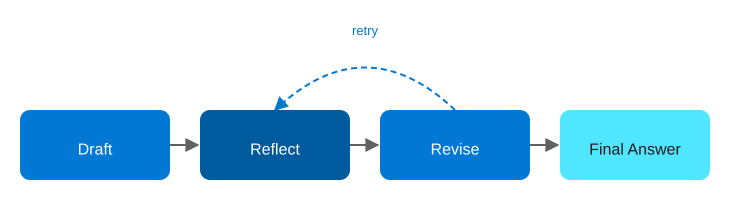

# Agentic AI Design Patterns on Azure, Part 3: Reflection

<!-- Meta description: Explore the Reflection agentic AI pattern on Azure, where agents draft, critique, and revise their own answers using Durable Functions. -->

Reflection adds a second pass: the agent writes an initial answer, then reviews its own work before it's shown to the user. It's a small change, but it has an outsized effect on quality-critical outputs — code generation, compliance language, and anything where "good enough on the first try" isn't good enough.

## The Reflection pattern

`Initial Answer → Reflect (self-review) → Revise Answer → Final Answer`

<figure>
  
  <figcaption>The Reflection pattern: the agent drafts, reflects, and revises before returning a final answer.</figcaption>
</figure>

This pattern works best for quality-critical outputs, code, compliance text, and any scenario where accuracy matters more than speed.

## Azure architecture

| Component | Azure Service | Role |
|---|---|---|
| Drafting | Azure OpenAI Service (GPT-4o) | Produces the initial answer |
| Critique | Azure OpenAI Service (same or a second, cheaper deployment e.g. GPT-4o-mini) | Reviews the draft against a rubric and returns structured issues |
| Revision | Azure OpenAI Service | Produces the final answer conditioned on the critique |
| Orchestration | Durable Functions | Chains draft → critique → revise as a durable, replay-safe sequence, with an optional loop if the critique still fails the rubric |
| Audit trail | Azure Blob Storage | Stores every draft/critique/revision triple for compliance review |

Using a cheaper model deployment for the critique step (GPT-4o-mini rather than GPT-4o) is a deliberate cost optimization — critique is a narrower task than generation and doesn't need the largest model.

## Implementation walkthrough

The Durable orchestrator runs three activity functions in sequence. `DraftAnswer` calls Azure OpenAI with the user's request. `ReflectOnDraft` calls it again with a system prompt that asks the model to act as a reviewer against an explicit rubric (accuracy, completeness, tone) and return a structured JSON verdict — `pass` or a list of issues. If the verdict is `pass`, the orchestrator returns the draft as final; otherwise `ReviseAnswer` is called with the draft and the critique, and the orchestrator can loop back to `ReflectOnDraft` up to a configurable retry limit before giving up and returning the best available draft with a flag.

Every stage's input and output is written to Blob Storage under a run ID, which is what makes this pattern genuinely usable for compliance-sensitive content — you can show the full self-review trail, not just the final answer.

## Deploying it

`azd up` provisions Azure OpenAI with two deployments (a primary and a lighter-weight critique model), a Durable Functions Function App, a storage account for both the Durable Task Hub and the audit trail container, and Application Insights.

```bash
azd auth login
azd up
```

## When to reach for this pattern

Use Reflection when the cost of a bad first answer is higher than the cost of a second model call. Generated code, legal or compliance-adjacent text, and anything customer-facing where tone matters all qualify. That said, skip it for latency-sensitive, low-stakes lookups, because doubling the number of model calls doubles the latency and cost for no benefit if the first-pass answer is already reliably good.

**Repo:** `repos/03-reflection` — Bicep IaC + C# Durable Functions draft/critique/revise sample.
