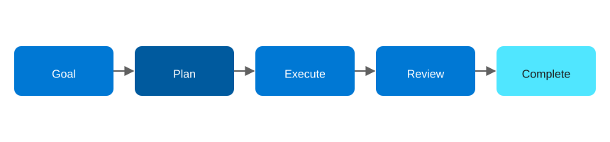

# Agentic AI Design Patterns on Azure, Part 4: Planning

<!-- Meta description: See how the Planning agentic AI pattern breaks goals into steps on Azure using Durable Functions, Azure OpenAI, and Logic Apps. -->

Planning breaks a large goal into a list of executable steps up front, then works through them one at a time, tracking progress until every step is complete. In short, it's the pattern that turns "do this big vague thing" into a checklist an agent (or a human) can actually execute against — the backbone of multi-step business workflows and SOP automation.

## The Planning pattern

`Goal → Step 1, Step 2, ... Step N → Execute → Review → Complete`

<figure>
  
  <figcaption>The Planning pattern: the agent turns a goal into a plan, then executes and reviews each step.</figcaption>
</figure>

This pattern works best for complex tasks, project execution, SOP automation, and long-running workflows.

## Azure architecture

| Component | Azure Service | Role |
|---|---|---|
| Plan generation | Azure OpenAI Service (GPT-4o) | Decomposes the goal into an ordered list of steps as structured output |
| Plan execution | Durable Functions (orchestrator + activity functions) | Executes each step, tracks state, retries failures, marks completion |
| Step registry | Azure Functions (activity functions per step type) | Concrete implementations for each kind of step the planner can emit (e.g. "call API", "summarize", "notify") |
| State/progress | Durable Functions entity or Azure Table Storage | Tracks per-step status (pending/executing/complete/failed) for visibility |
| Notifications | Azure Logic Apps (optional) | Sends progress updates or escalates failed steps to a human |

The plan itself is treated as data, not code: the model emits a JSON array of typed steps, and the orchestrator dispatches each one to the matching activity function by type. This keeps the step vocabulary small and auditable rather than letting the model invent arbitrary actions.

## Implementation walkthrough

`GeneratePlan` prompts Azure OpenAI with the goal and a schema describing the allowed step types, and gets back an ordered JSON plan. The Durable orchestrator then iterates the plan, calling `ExecuteStep` for each entry with automatic retry (`RetryOptions`) and updating a Durable entity that holds live status for every step. If a step's activity function throws after exhausting retries, the orchestrator marks the plan as failed at that step and — in the sample — calls a Logic Apps workflow to notify a human, rather than silently continuing.

Because the plan and its execution state are durable, a long-running plan (minutes to hours, spanning steps that call external systems) survives Function App restarts and scale-in events without losing progress.

## Deploying it

`azd up` provisions Azure OpenAI, a Durable Functions Function App, Table Storage for step status, a Logic Apps Standard workflow for failure notifications, and Application Insights.

```bash
azd auth login
azd up
```

## When to reach for this pattern

Use Planning when a goal reliably decomposes into a sequence of known step *types*, even if the exact steps vary per run. Onboarding workflows, report generation pipelines, and multi-stage approvals are good examples. However, if the next step genuinely depends on observing the result of the previous one in ways the plan can't anticipate, ReAct is the better fit, since Planning commits to the full step list before execution starts.

**Repo:** `repos/04-planning` — Bicep IaC + C# Durable Functions planner/executor sample.
