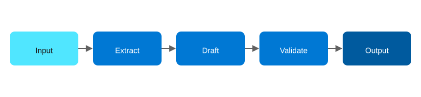

# Agentic AI Design Patterns on Azure, Part 6: Sequential Chain

<!-- Meta description: Understand the Sequential Chain agentic AI pattern on Azure, built with Durable Functions and Azure OpenAI for fixed pipelines. -->

Sequential Chain is the pattern for structured business processes: the output of one agent becomes the input to the next, in a fixed pipeline. There's no branching and no re-planning here — just a series of well-defined stages. Because of that simplicity, it's a natural fit for a low-code orchestration layer rather than hand-written control flow.

## The Sequential Chain pattern

`Input → Agent 1 → Agent 2 → ... → Agent N → Output`

<figure>
  
  <figcaption>The Sequential Chain pattern: a fixed pipeline where each stage's output feeds the next.</figcaption>
</figure>

This pattern works best for pipelines, ETL, content generation, and step-by-step processing.

> **Implementation note:** the architecture below is the general case for this pattern — a fixed, declarative chain is a natural fit for a low-code workflow engine like Logic Apps Standard, and that's a reasonable default choice for a production build-out. The deployable sample in this repo builds the same fixed three-stage pipeline on Durable Functions instead, because it turned out to be a substantially more reliable target to provision and operate than Logic Apps Standard's `ServiceProvider`-connector model during testing. The conceptual pattern — and the "why" below — holds either way; see [`patterns/06-sequential-chain/README.md`](../patterns/06-sequential-chain/README.md) for exactly what's deployed.

## Azure architecture

| Component | Azure Service | Role |
|---|---|---|
| Pipeline orchestration | Azure Logic Apps (Standard), *or* Durable Functions (as built in this repo's sample) | Defines the fixed sequence of stages; each stage is a workflow action or orchestrator-called activity |
| Each chain stage | Azure OpenAI Service | Performs one transformation (e.g. extract → summarize → translate → format) |
| File/document intake or output | Azure Blob Storage | Drop location for output artifacts (and, in a Logic Apps build, the trigger source too) |
| Structured hand-off | Azure Service Bus | Notifies a downstream system once the chain completes |
| Observability | Azure Monitor + run history (Logic Apps) or Application Insights (Durable Functions) | Every stage's input/output is visible without custom logging either way |

The core idea either way: because the chain is fixed, you don't need general-purpose control flow to run it — just a sequence of steps with per-step retry, and durable state so a mid-chain failure doesn't force re-running from the top.

## Implementation walkthrough

The chain has three stages, each a distinct call to Azure OpenAI with its own prompt and its own narrow view of the data: stage one extracts structured fields (intent, entities, sentiment) from the raw input as JSON; stage two drafts a response using only stage one's output as context; stage three validates the draft for tone and consistency and returns the final approved text. The final output is written to Blob Storage and dropped on a Service Bus queue for a downstream system to pick up. Each stage has its own retry policy, so a transient failure at stage two doesn't require re-running stage one.

In a Logic Apps Standard build, each stage is a distinct workflow action with retry settings (`count`, `interval`, exponential backoff) and the run history preserves every stage's input/output automatically. In the Durable Functions build used in this repo's sample, the same shape holds: a single orchestrator function calls three sequential activities with `CallActivityAsync` and Durable's built-in `RetryOptions`, and each activity's input/output is visible per-invocation in Application Insights.

## Deploying it

For the sample as built in this repo (Durable Functions): `azd up` provisions a Durable Functions Function App, Blob Storage with an output container, a Service Bus namespace and queue, Azure OpenAI, and Application Insights.

```bash
azd auth login
azd up
```

## When to reach for this pattern

Use Sequential Chain when the stages and their order are known and fixed: content pipelines, document processing, and structured ETL over unstructured input all qualify. It's also the cheapest pattern to operate and reason about, because there's no dynamic branching to test. That said, if you find yourself wanting a stage to conditionally skip or repeat based on model output, you've drifted into Planning or ReAct territory.

**Repo:** `patterns/06-sequential-chain` — Bicep IaC + C# Durable Functions three-stage chain calling Azure OpenAI in sequence.
