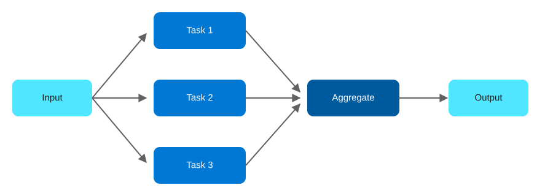

# Agentic AI Design Patterns on Azure, Part 7: Parallel Fan-out/Fan-in

<!-- Meta description: Learn how the Parallel Fan-out/Fan-in agentic AI pattern speeds up processing on Azure using Durable Functions' Task.WhenAll support. -->

Parallel Fan-out/Fan-in runs multiple agents at the same time over the same input, then combines their results at the end, instead of running them one after another. When the sub-tasks are independent, this is a straightforward way to cut latency and scale horizontally. Better still, it happens to be a first-class, named pattern in Azure Durable Functions.

## The Parallel Fan-out/Fan-in pattern

`Input → Agent A, Agent B, ... Agent N (parallel) → Aggregator (Join, e.g. Σ) → Output`

<figure>
  
  <figcaption>The Parallel Fan-out/Fan-in pattern: independent tasks run at once, then join into one output.</figcaption>
</figure>

This pattern works best for independent tasks, data processing, summaries, and analysis at scale.

## Azure architecture

| Component | Azure Service | Role |
|---|---|---|
| Fan-out orchestration | Durable Functions (`Task.WhenAll`) | Starts all agent activity functions concurrently and waits for every result |
| Each parallel agent | Azure Functions (activity functions), Azure OpenAI Service | Independently processes its own slice of the input (e.g. one document chunk, one region's data, one perspective on the question) |
| Aggregation | Durable Functions (orchestrator, post-`WhenAll`) | Combines all N results — the "Σ" step — using either deterministic logic or a final Azure OpenAI summarization call |
| Scale-out compute | Azure Functions Premium or Consumption plan | Scales the activity function instances automatically to match fan-out width |
| Result storage | Azure Blob Storage | Optionally persists each parallel branch's raw output alongside the aggregated result for auditability |

`Task.WhenAll` inside a Durable Functions orchestrator is literally the fan-out/fan-in pattern the Durable Functions documentation names — this is the one pattern in the set of nine where the Azure primitive and the design pattern share a name.

## Implementation walkthrough

The orchestrator function splits the input (in the sample, a long document) into N chunks, then calls `context.CallActivityAsync` once per chunk without awaiting each individually, collecting the tasks into a list. `await Task.WhenAll(tasks)` fans out — Durable Functions schedules all N activity invocations to run concurrently across available Function instances — and blocks until every chunk's activity function (a per-chunk Azure OpenAI summarization call) has returned. Once all results are in, a final aggregation activity calls Azure OpenAI once more with all N partial summaries to produce a single coherent output — the fan-in "join" step.

Because each branch is an independent Durable activity, a single chunk failing can be retried in isolation (via `RetryOptions`) without re-running the other N-1 branches — a meaningful advantage over a hand-rolled `Task.WhenAll` in a plain Function.

## Deploying it

`azd up` provisions Azure OpenAI, a Durable Functions Function App on a Premium plan (for reliable concurrent scale-out), storage for the Durable Task Hub, and Application Insights.

```bash
azd auth login
azd up
```

## When to reach for this pattern

Use Parallel Fan-out/Fan-in when the sub-tasks genuinely don't depend on each other: summarizing independent document chunks, scoring a batch of items, or gathering N independent perspectives before synthesis are all good fits. However, if a later branch needs the result of an earlier one, this collapses back into Sequential Chain, so don't force parallelism onto a problem that has a real dependency order.

**Repo:** `repos/07-parallel-fanout-fanin` — Bicep IaC + C# Durable Functions fan-out/fan-in sample.
