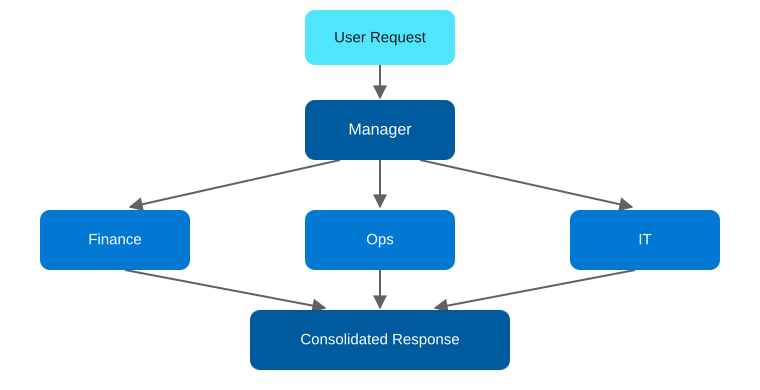

# Agentic AI Design Patterns on Azure, Part 8: Hierarchical

<!-- Meta description: Explore the Hierarchical agentic AI pattern on Azure, where a manager agent delegates to domain sub-agents via AI Foundry and Service Bus. -->

Hierarchical looks similar to Orchestrator at a glance, but the relationship is different: a manager agent supervises expert sub-agents rather than simply routing to them. In addition, the sub-agents can be organized by domain the way a large organization is — Finance, Ops, IT, each with its own expert. As a result, it's the pattern for large, multi-domain systems where governance and clear ownership per domain matter as much as the answer itself.

## The Hierarchical pattern

`User Request → Manager Agent (Top Agent) → Sub Agent A (Finance), Sub Agent B (Ops), ... Sub Agent N (IT) → Consolidate & Respond`

<figure>
  
  <figcaption>The Hierarchical pattern: a manager agent delegates to domain sub-agents, then consolidates their answers.</figcaption>
</figure>

This pattern works best for large organizations, multi-domain systems, and governance-heavy delegation.

## Azure architecture

| Component | Azure Service | Role |
|---|---|---|
| Manager agent | Azure AI Foundry Agent Service | Supervises the request: decomposes it into domain-specific sub-tasks, dispatches, and consolidates final output; owns the overall conversation and policy |
| Sub-agents | Azure Functions (one per domain, each with its own Azure OpenAI deployment/system prompt) | Domain experts — Finance, Ops, IT in the sample — each independently authoritative within its own scope |
| Domain data | Azure Cosmos DB (Finance), Azure SQL Database (Ops), Azure AI Search (IT knowledge base) | Each sub-agent grounds its answers in its own domain's data store, deliberately kept separate |
| Inter-agent messaging | Azure Service Bus (topics with per-domain subscriptions) | Manager publishes sub-tasks to a topic; each domain subscription is filtered so only the relevant sub-agent receives it |
| Governance | Microsoft Entra ID + Azure Policy | Enforces which identities can invoke the manager, and which sub-agents can access which domain data stores |

The distinction that matters operationally: in Orchestrator, specialists are largely stateless tools the coordinator calls. In Hierarchical, sub-agents are semi-autonomous — the manager delegates authority, not just work, and consolidation is closer to "reconcile three domain expert opinions" than "merge three API responses."

## Implementation walkthrough

The manager agent, defined in Azure AI Foundry, receives the request and produces a decomposition — which domains are relevant and what each should be asked. It publishes one Service Bus message per relevant domain to a topic with subscription filters (`Domain = 'Finance'`, etc.), so only the matching sub-agent Function picks it up. Each sub-agent processes its message asynchronously against its own data store and posts its response to a reply queue the manager is listening on. Once all expected replies arrive (or a timeout elapses), the manager calls Azure OpenAI one more time to reconcile the sub-agents' answers — including surfacing disagreement between domains explicitly rather than silently picking one — before responding to the user.

The async, message-based hand-off (rather than direct HTTP calls) is what lets sub-agents scale and fail independently, and is the main infrastructure difference from the Orchestrator sample.

## Deploying it

`azd up` provisions the Azure AI Foundry project and manager agent, three domain sub-agent Function Apps, a Service Bus namespace with a topic and per-domain subscriptions plus a reply queue, Cosmos DB, Azure SQL Database, Azure AI Search, and Application Insights.

```bash
azd auth login
azd up
```

## When to reach for this pattern

Reach for Hierarchical when domains are owned by different teams or systems of record and you need that separation preserved in the architecture, not just in the prompt. Regulated industries and large enterprises are the common case. On the other hand, if your specialists are really just stateless tools with no independent data ownership, Orchestrator is simpler and cheaper to run.

**Repo:** `repos/08-hierarchical` — Bicep IaC + Azure AI Foundry manager agent + Service Bus-connected domain sub-agents.
