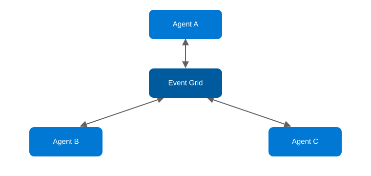

# Agentic AI Design Patterns on Azure, Part 9: P2P Mesh

<!-- Meta description: See how the P2P Mesh agentic AI pattern removes central coordination on Azure using Event Grid pub-sub between independent agents. -->

P2P Mesh removes the central coordinator entirely: agents collaborate directly, each reacting to events from the others, with no single point that decides what happens next. Consequently, it's the pattern for decentralized, resilient agent ecosystems. The trade-off is that you give up the simplicity of a single control point in exchange for no single point of failure.

## The P2P Mesh pattern

`Agent A ↔ Agent B ↔ Agent C ↔ Agent N (all interconnected) → Final Output`

<figure>
  
  <figcaption>The P2P Mesh pattern: agents react to each other's events through a shared event backbone, with no central coordinator.</figcaption>
</figure>

This pattern works best for decentralized systems, resilience, and emergent collaboration.

## Azure architecture

| Component | Azure Service | Role |
|---|---|---|
| Event backbone | Azure Event Grid (custom topic) | Every agent publishes events it produces and subscribes to the event types it cares about — the mesh's connective tissue, with no central router |
| Each mesh agent | Azure Functions (Event Grid-triggered) | Independently deployed and scaled; reacts to relevant events, calls Azure OpenAI, and may publish new events in response |
| Shared state (where needed) | Azure Cosmos DB | A shared, eventually-consistent store agents can read/write to coordinate on shared facts without talking to each other directly |
| Completion detection | Azure Durable Functions (a lightweight "watcher" entity, not a coordinator) | Watches for a terminal event type to know when to surface the final output — deliberately has no authority over the agents themselves |
| Observability | Application Insights (distributed tracing via correlation IDs on events) | Because there's no central orchestrator, distributed tracing via correlation IDs is the only way to reconstruct what happened across a run |

Event Grid is doing the job a message broker does in pub-sub architectures generally: agents don't know about each other, they only know about event types. That's what makes the mesh resilient — any agent can be added, removed, or restarted without the others needing to change.

## Implementation walkthrough

Three sample agents — a `ResearchAgent`, a `FactCheckAgent`, and a `SynthesisAgent` — each an Event Grid-triggered Function subscribed to specific event types on a shared custom topic. `ResearchAgent` reacts to `request.created` events, calls Azure OpenAI, and publishes a `research.completed` event. `FactCheckAgent` independently subscribes to `research.completed`, verifies claims against Azure AI Search, and publishes `factcheck.completed`. `SynthesisAgent` subscribes to both completion events, waits (via a Cosmos DB counter) until it's seen both for a given correlation ID, then produces the final output and publishes `mesh.completed`. No agent calls another agent directly, and no agent knows the full picture — each just reacts to the events it's subscribed to.

A lightweight watcher (a Durable entity keyed by correlation ID) subscribes to `mesh.completed` purely to let the calling client know the mesh has finished — it has no say in how the agents behave, which is the important distinction from an orchestrator.

## Deploying it

`azd up` provisions an Event Grid custom topic with subscriptions for each agent Function, three Event Grid-triggered Function Apps, Azure OpenAI, Azure AI Search, Cosmos DB for shared state, and Application Insights.

```bash
azd auth login
azd up
```

## When to reach for this pattern

Reach for P2P Mesh when you genuinely need agents that can be added, removed, or scaled independently without a central bottleneck. Multi-team agent ecosystems, or systems where resilience to a coordinator failing matters more than predictability, are the clearest cases. That said, it's the hardest pattern to debug and reason about of the nine, precisely because there's no single place execution flows through. For that reason, don't adopt it until Orchestrator or Hierarchical has actually become a bottleneck.

**Repo:** `repos/09-p2p-mesh` — Bicep IaC + C# Event Grid-triggered Azure Functions mesh sample.
